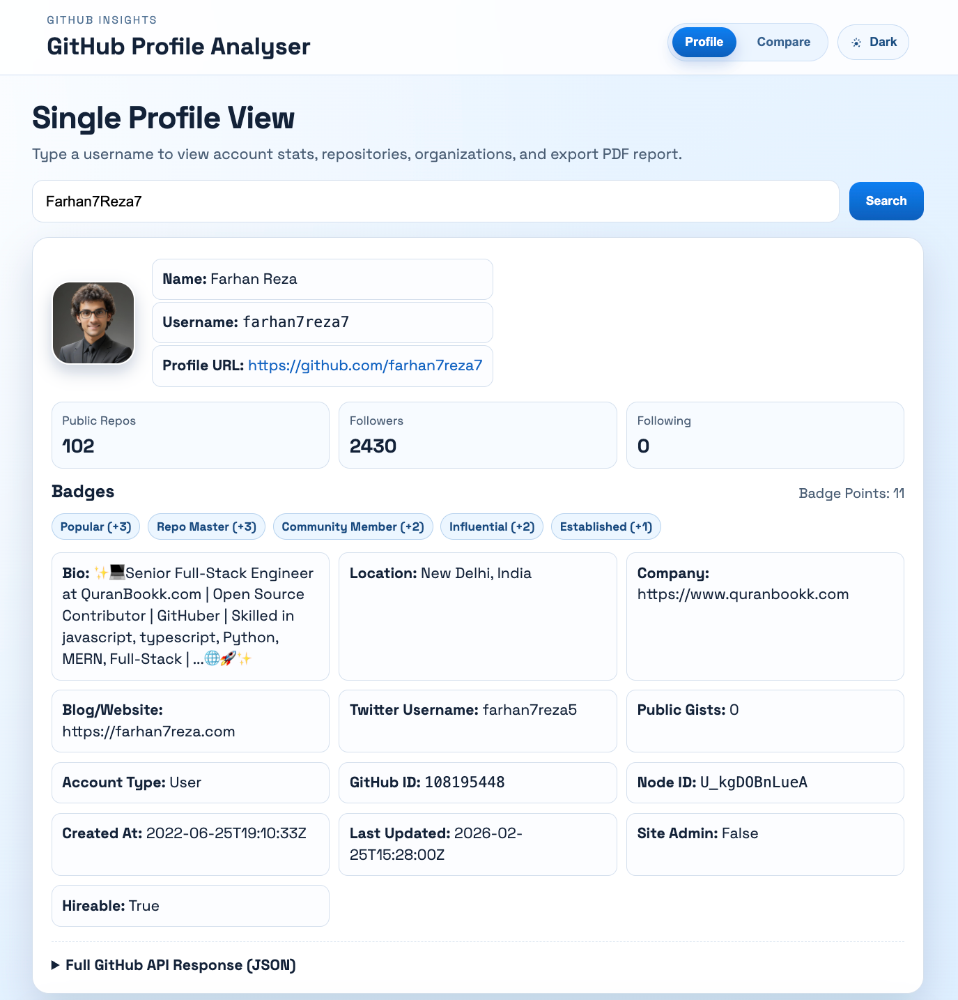

<div align="center">
  
  # 📊 GitHub Profile Analyzer
  <p align="center">
    <strong>A powerful tool to analyze, compare, and generate insights from GitHub profiles with 18 different metrics and smart scoring system</strong>
  </p>
  <p align="center">
    <a href="https://github.com/KouroshPanahi/Github-Profile-Analyser/stargazers">
      
    </a>
    <a href="https://github.com/KouroshPanahi/Github-Profile-Analyser/network/members">
      
    </a>
    <a href="https://github.com/KouroshPanahi/Github-Profile-Analyser/issues">
      
    </a>
    <a href="https://github.com/KouroshPanahi/Github-Profile-Analyser/blob/main/LICENSE">
      
    </a>
  </p>
  <p align="center">
    <a href="#-features">Features</a> •
    <a href="#-live-demo">Live Demo</a> •
    <a href="#-installation">Installation</a> •
    <a href="#-usage">Usage</a> •
    <a href="#-api-rate-limit--token-support">API Token</a> •
    <a href="#-scoring-system">Scoring System</a> •
    <a href="#-contributing">Contributing</a>
  </p>
  <br>
  
  
  
  <br>
  <br>
  
  <a href="https://your-deployment-url.vercel.app/">
    
  </a>
  
</div>
---
## ✨ Features
✅ **Complete Profile Analysis** - Get detailed information about any GitHub user including name, bio, followers, following, public repos, and more

✅ **Smart Profile Comparison** - Compare two GitHub profiles side-by-side with 18 different metrics and automatic scoring

✅ **PDF Report Generation** - Download comprehensive PDF reports of any profile analysis

✅ **Repository Analysis** - View all public repositories sorted by stars and forks

✅ **Organization Memberships** - See which organizations the user belongs to

✅ **Caching System** - Optimized API calls with built-in caching for faster performance and reduced rate limit usage

✅ **Advanced Search** - Find users with advanced filtering options

✅ **No Login Required** - 100% free and secure - we never ask for your GitHub password

✅ **GitHub API Rate Limit Support** - Use your own token for up to 5000 requests/hour


## 🎯 Why GitHub Profile Analyzer?
 Unlike competing projects, this tool respects your security - no account creation, no password requests, no hidden costs. Just pure functionality.
GitHub has evolved from a simple code hosting platform to a portfolio of your skills and contributions. This tool helps you:
- **Understand your GitHub presence** - See how your profile looks to recruiters and other developers
- **Compare yourself with others** - Find out where you stand compared to your peers or role models
- **Track your growth** - Monitor your progress over time with detailed metrics
- **Create professional reports** - Generate PDF reports for job applications or personal records
---
## 🚀 Live Demo
Check out the live version: **[GitHub Profile Analyzer Demo](https://your-deployment-url.vercel.app/)**
Try it now with these examples:
- `octocat` - GitHub's mascot
- `torvalds` - Linus Torvalds
- Your own username!
---

## 🏆 Scoring System

When comparing two profiles, we calculate scores based on 18 points distributed across these metrics:

|Metric|Points|Description|
|---|---|---|
|**Followers**|4|Number of followers (capped at 1000+ for fairness)|
|**Public Repositories**|3|Total number of public repos|
|**Organizations**|2|Number of organizations the user belongs to|
|**Account Age**|2|Age of the account in days (capped at 5+ years)|
|**Followers/Following Ratio**|2|Ratio showing popularity vs. following others|
|**Achievement Badges**|3|Presence of GitHub achievements|
|**Badge Count**|1|Total number of achievement badges|

### Score Interpretation

- **0-6 points**: Getting started
    
- **7-12 points**: Active developer
    
- **13-15 points**: Experienced contributor
    
- **16-18 points**: GitHub superstar ⭐
    

---

## 🛠️ Technology Stack

|Component|Technology|
|---|---|
|**Frontend**|HTML5, CSS3, Bootstrap 5|
|**Backend**|Python, Flask|
|**API Integration**|Requests library, GitHub REST API|
|**PDF Generation**|WeasyPrint / pdfkit|
|**Caching**|Flask-Caching|
|**Deployment**|Gunicorn, Waitress|

---

---

## 🤝 Contributing

Contributions are welcome! Here's how you can help:

### Ways to Contribute

- 🐛 **Report bugs** - Open an issue with detailed reproduction steps
    
- 💡 **Suggest features** - Share your ideas for improvements
    
- 📝 **Improve documentation** - Fix typos, add examples, translate
    
- 🔧 **Submit code changes** - Fix bugs or add new features
    
### Development Guidelines

- Follow PEP 8 style guide for Python code
    
- Write clear commit messages
    
- Add comments for complex logic
    
- Update documentation when needed
    
- Test your changes locally before submitting
    

---

## 📋 Roadmap

- Basic profile analysis
    
- Profile comparison with scoring
    
- PDF report generation
    
- API token support
    
- **AI-powered insights** (in progress) 🤖
    
- Contribution heatmap visualization
    
- Repository quality analysis
    
- Trending repositories by language
    
- Browser extension
    
- Mobile app
    

---

## ⚠️ Important Notes

> **Security First** 🔒
> 
> This application never asks for your GitHub password. All authentication is optional and only requires a token with minimal permissions if you choose to use one for higher rate limits.

> **Privacy** 🕵️
> 
> We only access public information. No data is stored on our servers - all analysis is done in real-time using GitHub's public API.

---

## 📄 License

This project is licensed under the MIT License - see the LICENSE file for details.

---

## 👏 Acknowledgements

- [GitHub API](https://docs.github.com/en/rest) for providing the data
    
- [Flask](https://flask.palletsprojects.com/) for the web framework
    
- [Bootstrap](https://getbootstrap.com/) for the UI components
    
- All our [contributors](https://github.com/KouroshPanahi/Github-Profile-Analyser/graphs/contributors) and supporters
    

---

## 📬 Contact & Support

- **Maintainer**: [Kourosh Panahi](https://github.com/KouroshPanahi)
    
- **Project Link**: [https://github.com/KouroshPanahi/Github-Profile-Analyser](https://github.com/KouroshPanahi/Github-Profile-Analyser)
    
- **Issues**: [Report a bug](https://github.com/KouroshPanahi/Github-Profile-Analyser/issues)
    
- **Discussions**: [Start a discussion](https://github.com/KouroshPanahi/Github-Profile-Analyser/discussions)
    

---

<div align="center">

### ⭐ If you found this project useful, please consider giving it a star!

<a href="https://github.com/KouroshPanahi/Github-Profile-Analyser/stargazers">  </a> <br> <br>

Made with ❤️ by Kourosh Panahi

</div> ```
